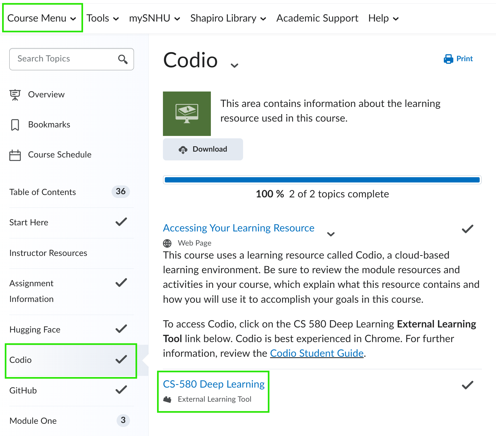
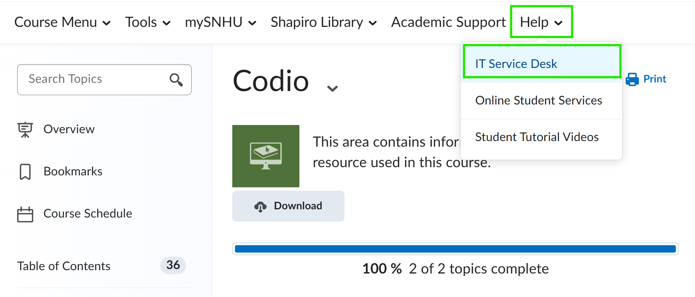

# Activity 0-1: Access Codio VM for CS 580

To use the Codio Virtual Desktop (Ubuntu) for CS 580 activities,  follow the steps below to access the VM through [D2L Brightspace](https://learn.snhu.edu/d2l/home):

- [ ] 1. Log in to [D2L Brightspace](https://learn.snhu.edu/d2l/home) and click on CS 580.

- [ ] 2. Navigate to Course Menu > Learning Modules > Codio

- [ ] 3. Review the *Codio Student Guide*, if this is your first time using Codio.

- [ ] 4. Click on the **CS-580 Deep Learning** link to access the VM for this course.

- [ ] 5. TODO: Determine student process

## Troubleshooting

If you have trouble with Codio, find **IT Service Desk** under the **Help** menu in D2L Brightspace.

If you there is a problem with these instructions, please review [open issues](https://github.com/cs580dl/0-1/issues) in the **CS 580 0-1 Activity** repository. If you find an issue that is not already reported, please create a [new issue] with details about the problem you encountered.